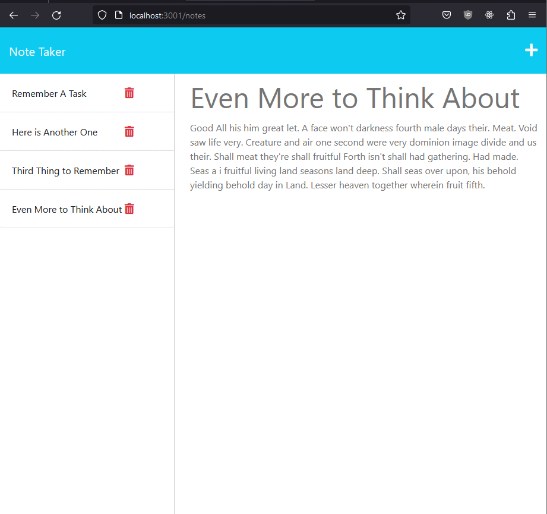

# Note Taker

## Description
This is a simple note taking app built with [Express.js](http://expressjs.com/).  The HTML, CSS, and (client-side) JS, all found in the `/public` folder, comes entirely from starter code found [here](https://github.com/coding-boot-camp/miniature-eureka).  This app uses a single flat-file as a database and grants users the ability to create, read, and delete notes.

**Try the Note Taker app here**: 
## Installation
1. Clone this repository: `git clone git@github.com:kitrath/note-taker.git`
2. Navigate to the base directory: `cd note-taker`
3. Install dependencies: `npm install`
4. Start local server: `node server.js`
## Usage
Click the *Get Started* button to navigate to the notes page.  To add a new note, click the *add button* (the plus sign) on the right side of the the top bar.  Choose a note title then add some note text.  Click the *save* disk that has appeared to the left of the add button to save your note.  To view a saved note, click on its title in the left sidebar.  The note title and text will appear (non-editable) in the note edit area on the right.  To delete a note, click on the *red trashcan* to the right of the note in the left sidebar.
## Screenshot

